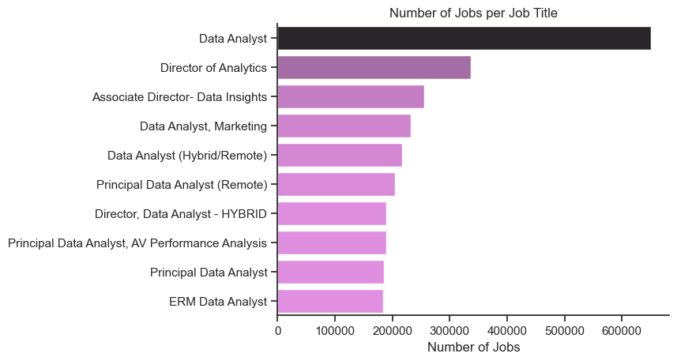
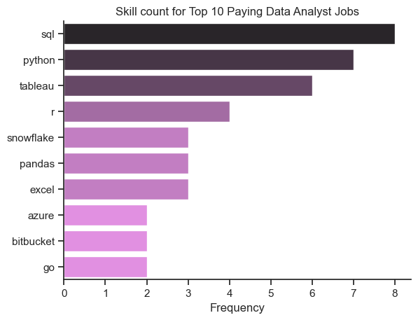

# Introduction
Welcome to my SQL Portfolio Project! Here, I explore the job market for data analysts. I look into which jobs pay the most, what skills are most needed, and where high demand meets high salaries in the filed of data analytics.

Please check SQL queries here: [project_sql folder](/project_sql/)


# Background
I started this project to better understand the data analyst job market. I wanted to find out which skills are most valuable and in demand, so I could focus my job search more effectively.

The data used for this analysis comes from Luke Barousse’s SQL Course. It includes information on job titles, salaries, locations, and required skills.

## The questions I tried to answer through the SQL queries were as follows:
1. What are the highest-paying jobs for Data Analysts?
2. What skills are needed for these high-paying jobs?
3. What skills are most in demand for data analysts?
4. Which skills lead to higher salaries?
5. What skills should a data analyst focus on to get the most value in the job market?

# Tools used
In this project, I used several tools to help with my analysis:

- **SQL**: Helped me work with the database, pull out insights, and answer key questions.
- **PostgreSQL**: The system I used to store, search, and manage the job data.
- **Visual Studio Code**: A free tool that helped me manage the database and run SQL queries.
- **Git & GitHub**: Kept track of changes and shared my SQL scripts and analysis for collaboration.

# Analysis
For this project, each query was designed to explore different parts of the data analyst job market. Here’s how I tackled each question:

## 1. Top Paying Data Analyst Jobs
To find the highest-paying roles, I looked at data analyst positions based on average yearly salary and location, especially remote jobs. This query shows the top-paying opportunities in the field.

Here’s a look at the top data analyst jobs in 2023:

- **Wide Salary Range:** The top 10 highest-paying roles range from $184,000 to $650,000, showing great earning potential.
- **Different Employers:** Companies like SmartAsset, Meta, and AT&T offer these high salaries, indicating interest from various industries.
- **Varied Job Titles:** There’s a wide range of job titles, from Data Analyst to Director of Analytics, highlighting different roles and specialties in the field.

```sql
SELECT
    job_id,
    job_title,
    job_location,
    job_schedule_type,
    salary_year_avg,
    job_posted_date,
    name AS company_name
FROM
    job_postings_fact
    LEFT JOIN company_dim ON job_postings_fact.company_id = company_dim.company_id
WHERE
    job_title_short = 'Data Analyst' AND
    job_location = 'Anywhere' AND
    salary_year_avg IS NOT NULL
ORDER BY
    salary_year_avg DESC
LIMIT 10;
```



_Bar graph showing the top 10 data analyst salaries; created by using Python (Matplotlib & Seaborn) from my SQL query results._


## 2. Skills for High-paying Jobs
To find out which skills are needed for the top-paying jobs, I combined job postings with skills data. This helped me see what employers look for in high-paying roles.

```sql
WITH top_paying_jobs AS (
    SELECT
        job_id,
        job_title,
        salary_year_avg,
        name AS company_name
    FROM
        job_postings_fact
        LEFT JOIN company_dim ON job_postings_fact.company_id = company_dim.company_id
    WHERE
        job_title_short = 'Data Analyst' AND
        job_location = 'Anywhere' AND
        salary_year_avg IS NOT NULL
    ORDER BY
        salary_year_avg DESC
    LIMIT 10
)

--------Skills required for those top paying Data Analyst jobs

SELECT
    top_paying_jobs.*,
    skills
FROM
    top_paying_jobs
    INNER JOIN skills_job_dim ON top_paying_jobs.job_id = skills_job_dim.job_id
    INNER JOIN skills_dim ON skills_job_dim.skill_id = skills_dim.skill_id
ORDER BY
    salary_year_avg DESC;
```




_Bar graph showing the skill counts for the top 10 highest paying data analyst jobs, generated by Python (Matplotlib & seaborn) from my SQL query results._

Here’s a summary of the most in-demand skills for the top 10 highest-paying data analyst jobs in 2023:

- **SQL** is the most needed skill, appearing 8 times.
- **Python** is also important, showing up 7 times.
- **Tableau** is highly sought after, appearing 6 times.
- Other skills like R, Snowflake, Pandas, and Excel are also in demand, but to varying extents.


## 3. Top In-demand Skills for Data Analysts
This query highlighted the skills most commonly requested in job postings, helping to focus on areas with high demand.

```sql
SELECT
    skills_dim.skills,
    COUNT(skills_job_dim.job_id) AS demand_count
FROM
    job_postings_fact
    INNER JOIN skills_job_dim ON job_postings_fact.job_id = skills_job_dim.job_id
    INNER JOIN skills_dim ON skills_job_dim.skill_id = skills_dim.skill_id
WHERE
    job_title_short = 'Data Analyst'
GROUP BY
    skills_dim.skills
ORDER BY
    demand_count DESC
LIMIT 5;
```

| Skills   | Demand Count |
|----------|--------------|
| SQL      | 7291         |
| Excel    | 4611         |
| Python   | 4330         |
| Tableau  | 3745         |
| Power BI | 2609         |

_Demand for the top 5 skills in data analyst job postings._

Here’s a look at the top skills for data analysts in 2023:

- **SQL and Excel** are key, showing that basic skills in data processing and spreadsheets are still crucial.
- **Programming and Visualization Tools** like Python, Tableau, and Power BI are also important, highlighting the growing need for technical skills in data analysis and presenting information.

## 4. High Salary Skills
Looking at the average salaries for different skills showed which skills pay the most.

```sql
SELECT
    skills_dim.skills,
    ROUND(AVG(salary_year_avg), 0) AS avg_salary
FROM
    job_postings_fact
    INNER JOIN skills_job_dim ON job_postings_fact.job_id = skills_job_dim.job_id
    INNER JOIN skills_dim ON skills_job_dim.skill_id = skills_dim.skill_id
WHERE
    job_title_short = 'Data Analyst' AND
    salary_year_avg IS NOT NULL AND
    ----job_work_from_home = True     ---optional for remote jobs
GROUP BY
    skills_dim.skills
ORDER BY
    avg_salary DESC
LIMIT 25;
```
| Skills        | Average Salary ($) |
|---------------|-------------------:|
| pyspark       |            208,172 |
| bitbucket     |            189,155 |
| couchbase     |            160,515 |
| watson        |            160,515 |
| datarobot     |            155,486 |
| gitlab        |            154,500 |
| swift         |            153,750 |
| jupyter       |            152,777 |
| pandas        |            151,821 |
| elasticsearch |            145,000 |

_The average salary for the top 10 paying skills for data analysts_

Here’s a summary of the top-paying skills for data analysts:

- **Big Data & Machine Learning Skills:** Analysts with expertise in big data tools (like PySpark and Couchbase), machine learning (like DataRobot and Jupyter), and Python libraries (like Pandas and NumPy) earn the highest salaries. These skills are highly valued for processing data and making predictions.

- **Software Development & Deployment Skills:** Knowledge of tools for development and deployment (like GitLab, Kubernetes, and Airflow) is also highly paid. Skills that support automation and manage data pipelines are in demand.

- **Cloud Computing Skills:** Familiarity with cloud and data engineering tools (like Elasticsearch, Databricks, and GCP) is important. Cloud computing skills can significantly increase earning potential in data analytics.

## 5. Best Skills to Learn
This query looked at which skills are both in high demand and offer high salaries, helping to identify the best skills to focus on for career growth.

```sql
SELECT
    skills_dim.skills,
    COUNT(skills_job_dim.job_id) AS demand_count,
    ROUND(AVG(job_postings_fact.salary_year_avg), 0) AS avg_salary
FROM
    job_postings_fact
    INNER JOIN skills_job_dim ON job_postings_fact.job_id = skills_job_dim.job_id
    INNER JOIN skills_dim ON skills_job_dim.skill_id = skills_dim.skill_id
WHERE
    job_title_short = 'Data Analyst' AND
    salary_year_avg IS NOT NULL AND
    job_work_from_home = True
GROUP BY
    skills_dim.skill_id
HAVING
    COUNT(skills_job_dim.job_id) > 10
ORDER BY
    avg_salary DESC,
    demand_count DESC
LIMIT
    25;
```

| Skill ID | Skills     | Demand Count | Average Salary ($) |
|----------|------------|--------------|-------------------:|
| 8        | go         | 27           |            115,320 |
| 234      | confluence | 11           |            114,210 |
| 97       | hadoop     | 22           |            113,193 |
| 80       | snowflake  | 37           |            112,948 |
| 74       | azure      | 34           |            111,225 |
| 77       | bigquery   | 13           |            109,654 |
| 76       | aws        | 32           |            108,317 |
| 4        | java       | 17           |            106,906 |
| 194      | ssis       | 12           |            106,683 |
| 233      | jira       | 20           |            104,918 |

_Most optimal skills for data analyst sorted by salary_

Here’s a summary of the best skills for data analysts in 2023:

- **Programming Languages:** Python and R are in high demand, with 236 and 148 mentions respectively. They have average salaries of about $101,397 for Python and $100,499 for R. These languages are highly valued but also common.

- **Cloud Tools:** Skills in cloud technologies like Snowflake, Azure, AWS, and BigQuery are in demand and offer good salaries. This shows the growing importance of cloud platforms and big data.

- **Business Intelligence & Visualization:** Tools like Tableau and Looker are crucial, with high demand and average salaries of around $99,288 for Tableau and $103,795 for Looker. They are essential for creating visual reports and insights from data.

- **Database Technologies:** Skills in traditional and NoSQL databases (such as Oracle, SQL Server, and NoSQL) are also important, with average salaries between $97,786 and $104,534. This highlights the need for expertise in data storage and management.

# What I learned
During this journey, I’ve upgraded my SQL skills with some powerful techniques:

- **Advanced Queries:** Learned to create complex queries, combine tables, and use WITH clauses for temporary tables.
- **Data Aggregation:** Got skilled with GROUP BY and aggregate functions like COUNT() and AVG() to summarize data effectively.
- **Analytical Skills:** Improved my ability to turn real-world questions into useful SQL queries that provide valuable insights.


## Insights of Project

Here are some key insights from the analysis:

- **Top-Paying Jobs:** The highest-paying remote data analyst jobs have a wide salary range, with some going up to $650,000!
- **Essential Skills:** Advanced SQL skills are needed for these top-paying jobs, making SQL crucial for earning a high salary.
- **Most In-Demand Skills:** SQL is the most requested skill in the data analyst job market, so it’s essential for job seekers.
- **High Salaries for Specialized Skills:** Skills like SVN and Solidity lead to the highest average salaries, showing that specialized knowledge can command higher pay.
- **Best Skills to Learn:** SQL stands out as both highly demanded and well-paid, making it one of the best skills to learn for maximizing job market value.

# Conclusions
This project improved my SQL skills and gave me useful insights into the data analyst job market. The results help guide which skills to focus on and how to approach job searching. By concentrating on skills that are in high demand and offer high salaries, aspiring data analysts can better compete in the job market. This shows how important it is to keep learning and adapting to new trends in data analytics.